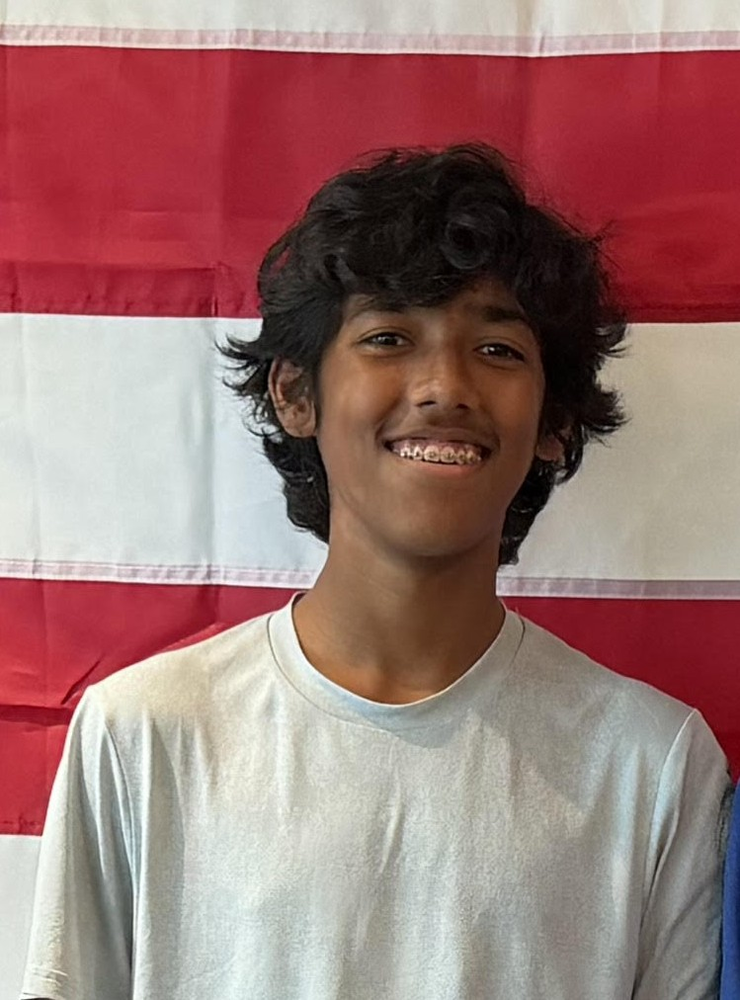

# Prarabdh Misra

**AI / ML builder — retrieval-augmented systems, Kaggle competitions, and conversational robotics.**

I build practical, end-to-end machine-learning systems: RAG assistants grounded in real
research, competition-grade notebooks, and voice-driven robots. I care about shipping things
that actually run, not just demos.

[GitHub](https://github.com/prarabdhmisra) ·
[Kaggle](https://www.kaggle.com/prarabdhmisra) ·
[LinkedIn](https://www.linkedin.com/in/prarabdhmisra/) ·
[Hugging Face](https://huggingface.co/prarabdhmisra) ·
[Email](mailto:prarabdh.misra@gmail.com)

* * *

## About

Hey, I'm Prarabdh — a high schooler (Class of 2029) in Johns Creek, GA, and I'm really into
AI, machine learning, and robotics. Right now I like building things end-to-end: I made a RAG
research assistant on Gradio, I work on machine-learning notebooks on Kaggle, and I built a
little conversational robot that switches backends on its own if one goes down. What I really
want next is a research internship where I can work on applied ML or RAG systems with an actual
research group. Any mentorship, feedback on my projects, or a lead on a lab looking for a
motivated student would mean a lot.

* * *

## Areas of Focus

- **Retrieval-Augmented Generation** — grounding LLMs in domain corpora with graph- and
  cost-aware retrieval strategies.
- **Applied ML & Kaggle** — feature engineering, gradient boosting (LightGBM), and
  reproducible notebook workflows.
- **Conversational Robotics** — hands-free, resilient voice agents with automatic
  multi-backend failover.

* * *

## Portfolio — Proof Points

### LabBot — research-grounded RAG assistant
A Gradio-based RAG chatbot that mirrors Prof. Zhao's research on Graph RAG (GRAG),
CG-RAG, and LLM cost reduction. Ingests a paper corpus and answers questions with
citations. Built on Gradio + a retrieval pipeline with pluggable Gemini / Hugging Face
backends.
[Live demo on Hugging Face →](https://huggingface.co/spaces/prarabdhmisra/lab-assistant)

### Kaggle notebooks
Competition and EDA notebooks — exploratory analysis plus LightGBM baselines and
iterations. Working toward Notebooks Grandmaster.
[View my Kaggle profile →](https://www.kaggle.com/prarabdhmisra)

### Reachy Mini "HARVI" — conversational robot
A hands-free voice robot built on the Reachy Mini platform. Talks in English with a
dual-backend architecture that boots on Gemini (live voice + motion) and automatically
fails over to a Hugging Face / Qwen backend if the primary is unhealthy — so it keeps
working without intervention.
_Write-up: (link a blog post or repo)_

* * *

## Get in touch

- Email: [prarabdh.misra@gmail.com](mailto:prarabdh.misra@gmail.com)
- GitHub: [github.com/prarabdhmisra](https://github.com/prarabdhmisra)
- Kaggle: [kaggle.com/prarabdhmisra](https://www.kaggle.com/prarabdhmisra)

<!-- TODO: optionally add the Reachy "HARVI" write-up/repo link and edit any wording above. -->
