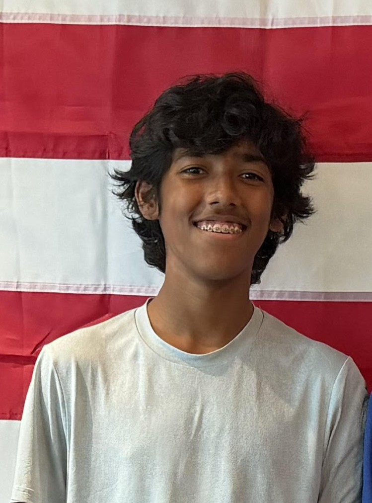
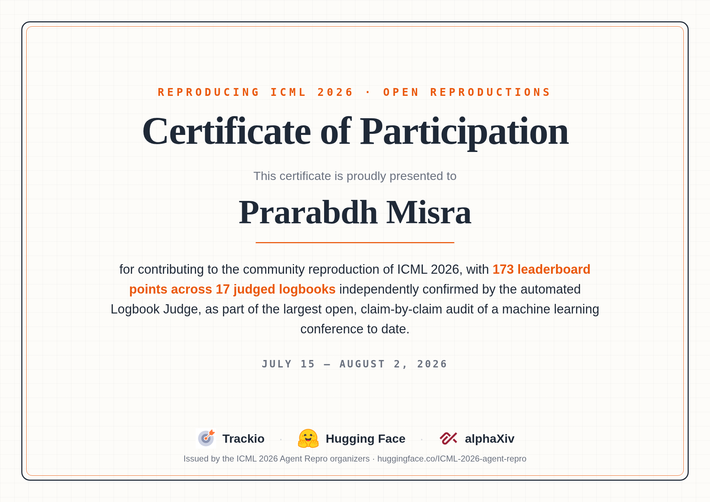

# Prarabdh Misra

**AI / ML builder — retrieval-augmented systems, reproducibility research, and conversational robotics.**

I build practical, end-to-end machine-learning systems: RAG assistants grounded in real
research, competition-grade notebooks, and voice-driven robots. I care about shipping things
that actually run, not just demos.

[GitHub](https://github.com/prarabdhmisra) ·
[Kaggle](https://www.kaggle.com/prarabdhmisra) ·
[LinkedIn](https://www.linkedin.com/in/prarabdhmisra/) ·
[Hugging Face](https://huggingface.co/prarabdhmisra) ·
[Email](mailto:prarabdh.misra@gmail.com)

* * *

## About

Hey, I'm Prarabdh — a high schooler (Class of 2029) in Johns Creek, GA, and I'm really into
AI, machine learning, and robotics. Right now I like building things end-to-end: I made a RAG
research assistant on Gradio, I work on machine-learning notebooks on Kaggle, and I built a
little conversational robot that switches backends on its own if one goes down. What I really
want next is a research internship where I can work on applied ML or RAG systems with an actual
research group. Any mentorship, feedback on my projects, or a lead on a lab looking for a
motivated student would mean a lot.

* * *

## Areas of Focus

- **Retrieval-Augmented Generation** — grounding LLMs in domain corpora with graph- and
  cost-aware retrieval strategies.
- **Applied ML & Kaggle** — feature engineering, gradient boosting (LightGBM), and
  reproducible notebook workflows.
- **Reproducibility Research** — re-running published ML results claim by claim and
  reporting verdicts with attached evidence, including falsifications.
- **Conversational Robotics** — hands-free, resilient voice agents with automatic
  multi-backend failover.
- **Edge ML / TinyML** — quantizing and deploying models onto microcontrollers and
  single-board computers (ESP32 / Arduino, Raspberry Pi / Jetson).

* * *

## Portfolio — Proof Points

### Lab Assistant RAG — research-grounded, cited RAG assistant
A Gradio RAG chatbot that answers questions over a research lab's publications **with inline
citations**, expands results along a **citation graph**, and **routes cheap vs. expensive
models** to save cost — with a grounding guard that declines unsupported questions.
Provider-agnostic (Gemini / OpenAI / Anthropic / Hugging Face / Ollama), and open-sourced as a
reusable template (MIT).
[Code on GitHub →](https://github.com/prarabdhmisra/lab-assistant-rag) ·
[Live demo on Hugging Face →](https://huggingface.co/spaces/prarabdhmisra/lab-assistant-rag)

### Kaggle notebooks
Competition and EDA notebooks — exploratory analysis plus LightGBM baselines and
iterations. Working toward Notebooks Grandmaster.
[View my Kaggle profile →](https://www.kaggle.com/prarabdhmisra)

### Reachy Mini "HARVI" — conversational robot
A hands-free voice robot built on the Reachy Mini platform. Talks in English with a
dual-backend architecture that boots on Gemini (live voice + motion) and automatically
fails over to a Hugging Face / Qwen backend if the primary is unhealthy — so it keeps
working without intervention.
Built during an internship at **[Snellings Walters Insurance Agency](https://snellingswalters.com/)**
in Atlanta, where I deployed it as a **receptionist robot** — it holds a conversation with
guests, answers questions about the company, and directs them to the right team.

* * *

## Publications

### Workshop papers — NeurIPS 2026
**Prarabdh Misra**, Mohd Ariful Haque.
*Where Edge VLA Latency Actually Goes: Measured Scaling Laws and Staleness Admissibility for a
450M Vision–Language–Action Model.* 2026.

- **Accepted (poster)** — NeurIPS 2026 Workshop on *On-Device Intelligence: Foundation Models
  under Real-World Constraints*, Sydney, December 2026.
- **Accepted** — NeurIPS 2026 Workshop on *Resource-Aware Agentic AI*, Atlanta, December 2026.

Measures where inference time actually goes when a 450M-parameter vision–language–action model
runs on edge hardware (NVIDIA T4 and Jetson AGX Orin). The action expert, not the vision encoder,
takes most of the budget. Caching vision across frames also costs more action accuracy than INT8
quantization does.
[Interactive benchmark on Hugging Face &rarr;](https://huggingface.co/spaces/prarabdhmisra/edgevla-bench)

* * *

## Research & Competitions

### Reproducing ICML 2026 — top 10% of the leaderboard
Placed **30th out of ~350 participants (top ~9%)** in *Reproducing ICML 2026 · Open
Reproductions* (Hugging Face × alphaXiv × Trackio, July 15 – August 2, 2026) — the largest open,
claim-by-claim audit of a machine-learning conference to date. I earned **173 leaderboard points
across 17 judged logbooks**, independently confirmed by the competition's automated Logbook Judge,
with **eight logbooks scoring a perfect 12/12**.

Each logbook re-runs a published ICML 2026 paper claim by claim and reports a verdict —
reproduced, reproduced at toy scale, inconclusive, or falsified — with the evidence attached.
Highlights include a human-in-the-loop reproduction and an independent **falsification** of a
published claim, both backed by runnable code and logged metrics.

[Browse my logbooks on Hugging Face &rarr;](https://huggingface.co/prarabdhmisra) &middot;
[Example: a falsified claim, with evidence &rarr;](https://huggingface.co/spaces/prarabdhmisra/Vv4XRZDMM0)

* * *

## Get in touch

- Email: [prarabdh.misra@gmail.com](mailto:prarabdh.misra@gmail.com)
- GitHub: [github.com/prarabdhmisra](https://github.com/prarabdhmisra)
- Kaggle: [kaggle.com/prarabdhmisra](https://www.kaggle.com/prarabdhmisra)
